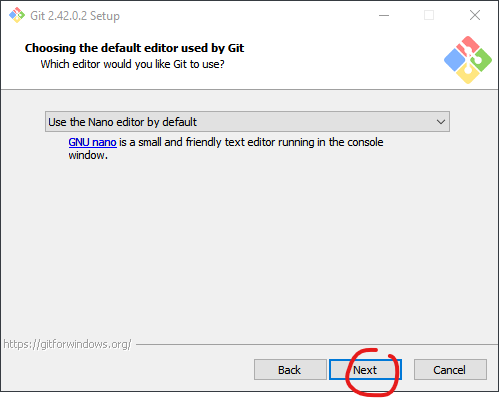
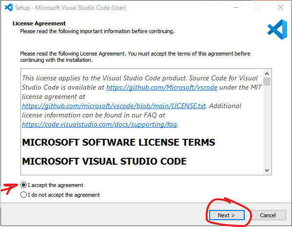

# .NET Environment Setup Guide
This guide will take you through installing essential tools for .NET on Windows.

## List of Tools
We'll be installing the following
- [Git](#git)
- [.NET SDK](#net-software-development-kit-sdk)
- [Visual Studio Code](#visual-studio-code)
- [VS Code Extensions Configuration](#visual-studio-code-extensions)
## Git
1. Navigate to [Git for Windows Installation Page](https://git-scm.com/download/win) and download the latest release of git.
    

2. Once the download finishes, locate the installer. It should be named something similar to the following file.

    

3. Click Next through the following 2 screens
    
    

4.    Optionally, you can check the "Add a Git Bash profile to Windows Terminal" option.    
    

5. You can leave this as is
    

6. **This step is _VERY IMPORTANT_!**
    Unless you know how to use vim, I highly recommend you change this option to nano or any other text editor you may have.
    
    

7. You can keep the recommended options for the remainder of this installer
    
    
    
    
    
    
    
    
    
    
    

8. Once the installation is finished, click the search button on your task bar and type "git bash". You should see the newly installed git bash software appear. Click on the icon to open it.
    

9. In git bash, next to the $ (dollar) sign, type "git --version" and hit enter. If you get some version information, that means you have successfully installed git.
    
    

## .NET Software Development Kit (SDK)

1. Navigate to [.NET SDK website](https://dotnet.microsoft.com/en-us/download) and click the .NET 7.0 download link

2. Locate the installer and double click on the file to execute it

3. Click Install

4. If this appears, click Yes

5. Installation is finished

6. Now open git bash to verify that .NET SDK has been successfully installed

7. Type 'dotnet --version' and hit enter. You should see 7.x.x as the response
 

## Visual Studio Code
1. Navigate to [Visual Studio Code Installation Page](https://code.visualstudio.com/) and click on the "Download for Windows" button
    

2. Once the download finishes, locate the installer. It will be a file named VSCodeUserSetup-x64-{versionNumber}
    
    
  
3. Accept the agreement and click next
    

4. Make sure all the checkboxes under Other is checked, then click Next
    

5. Click Install
    

6. VS Code is Now installed on your machine!
    

## Visual Studio Code Extensions
Prior to this section, please ensure that [Visual Studio Code (VSCode)](#visual-studio-code) is installed in your system. 

1. Search and Open VSCode

2. Click on the 5th icon from the left most column to navigate to extensions page. VS Code offers extensive extensions and they offer lots of useful functionalities. 
    
    We'll be installing the following
    - C# by Microsoft
    - C# XML Documentation Comments by Keisuke Kato
    - Live Share by Microsoft

3. C# by Microsoft offers the basic language support for C#

4. C# XML Documentation Comments by Keisuke Kato: This extension enables a keyboard shortcut to quickly scaffold documentation in our code

5. Live Share by Microsoft: This extension allows you to share your code editor window with others and collaborate in real time.
